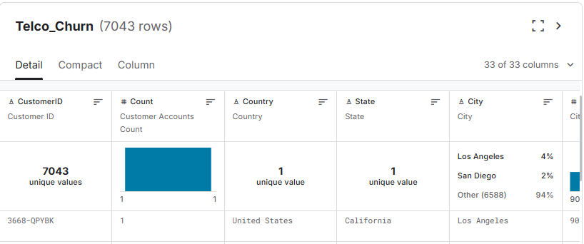
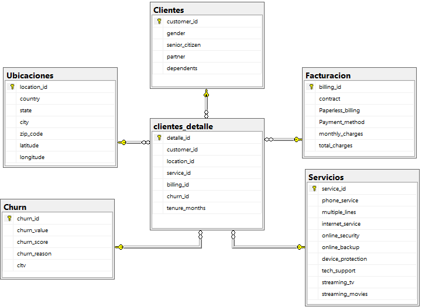

#  ProyectoSQL: Análisis de Churn en Clientes de Telecomunicaciones
## Resumen (Overview)
_La empresa de telecomunicaciones **PrimeLink Network** busca reducir la pérdida de clientes y mejorar sus estrategias de retención. Sin embargo, actualmente no cuenta con una visión clara sobre los factores que influyen en el abandono de sus servicios.
El objetivo de este proyecto es utilizar **SQL Server** para analizar la información de los clientes y detectar patrones relacionados con el churn. A través de consultas y análisis de datos, se evaluarán variables como el tipo de contrato, servicios contratados, métodos de pago, cargos mensuales y antigüedad del cliente._

## Estructura del Proyecto
- [Sobre los datos](#sobre-los-datos)
- [Modelado de datos](#modelado-datos)
- [Tareas](#tareas)
- [Limpieza de datos](#limpieza-de-datos)
- [Análisis Exploratorio de Datos e Insights](#análisis-exploratorio-de-datos-e-insights)
- [Conclusiones](#conclusiones)

## Sobre los datos
Los datos originales, junto con una explicacion de cada columna, se pueden encontrar [aqui](https://www.kaggle.com/datasets/abdallahwagih/telco-customer-churn).
El conjunto de datos proviene de una tabla de 33 columnas con mas de 7000 registros.



## Modelado de datos
A partir de una tabla inicial **Telco_Customer_Churn**, se diseñó un modelo relacional para organizar la información inspirado en un esquema estrella (Star Schema), por lo que se crearon las siguientes tablas:
- Clientes
- Ubicaciones
- Servicios
- Facturacion
- Churn
- clientes_detalle

Donde la tabla **clientes_detalle** actúa como tabla central de relaciones y las demás tablas almacenan información descriptiva. Por lo que este enfoque permitió mejorar la integridad de los datos.



## Tareas (Task)
1. ¿Cuántos clientes hay en total y cuantos aún permanecen?
2. ¿Cuántos clientes abandonaron y qué porcentaje representan del total?
3. ¿Cuál es la distribución de clientes por tipo de contrato?
4. ¿Cuál es el promedio de monthly_charges por tipo de contrato?
5. ¿Qué método de pago tiene más clientes y qué porcentaje representa?
6. ¿Cuál es la tasa de churn(abandono) por tipo de contrato?
7. ¿Cuáles son las principales razones de abandono según el tipo de servicio de internet?
8. ¿Cuáles son las ciudades con mayor tasa de churn considerando ciudades con más de 100 clientes?
9. ¿Qué características presentan los 20 clientes activos de mayor CLTV con servicios de internet?
10. ¿Cómo influye la antigüedad del cliente en la tasa de churn?

## Limpieza de datos
Fue necesario realizar una etapa de limpieza y validación de la información cargada desde el archivo CSV.

Durante esta etapa se identificaron algunos problemas comunes en los datos, como valores vacíos, posibles duplicados y espacios innecesarios.

```sql
--BUSCA VACIOS O VALORES NULOS EN MI TABLA TELCO_CUSTOMER 
SELECT *
FROM Telco_Customer_Churn
WHERE Total_Charges='' OR Total_Charges IS NULL;
```
Se identifico valores vacíos por lo hubo una conversión a valores nulos.

```sql
UPDATE Telco_Customer_Churn
SET total_charges = NULL
WHERE total_charges = '';
```

También se verifico que no hubiera valores repetidos, además de una limpieza de espacios en blancos.
```sql
--SE VERIFICA SI HAY VALORES DUPLICADOS EN MI TABLA CLIENTES
SELECT customer_id, COUNT(*)
FROM Clientes
GROUP BY customer_id
HAVING COUNT(*) > 1;

--LIMPIEZA DE ESPACIOS EN BLANCO PARA LA TABLA SERVICIOS
UPDATE Servicios
SET 
    phone_service = LTRIM(RTRIM(phone_service)),
    multiple_lines = LTRIM(RTRIM(multiple_lines)),
    internet_service = LTRIM(RTRIM(internet_service)),
    online_security = LTRIM(RTRIM(online_security)),
    online_backup = LTRIM(RTRIM(online_backup)),
    device_protection = LTRIM(RTRIM(device_protection)),
    tech_support = LTRIM(RTRIM(tech_support)),
    streaming_tv = LTRIM(RTRIM(streaming_tv)),
    streaming_movies = LTRIM(RTRIM(streaming_movies));

--LIMPIEZA DE ESPACIOS EN BLANCO PARA LA TABLA FACTURACION
UPDATE Facturacion
SET 
    contract = LTRIM(RTRIM(contract)),
    Paperless_billing = LTRIM(RTRIM(Paperless_billing)),
    Payment_method = LTRIM(RTRIM(Payment_method));

```

## Análisis Exploratorio de Datos (EDA) e Insights
### 1. ¿Cuántos clientes hay en total y cuantos aún permanecen?

Se realizó un conteo general de clientes registrados en la base de datos y, posteriormente, un conteo específico de aquellos clientes que aún permanecen activos en la empresa.

Se utilizó la función COUNT() para obtener la cantidad total de registros y una subconsulta junto con INNER JOIN para relacionar la tabla clientes_detalle con la tabla churn, donde se identifica si un cliente abandonó o continúa utilizando el servicio.

El campo churn_value fue utilizado como indicador de estado:
- 0 -> Cliente permanece activo
- 1 -> Cliente abandono

```sql
SELECT COUNT(1) AS NRO_CLIENTES,
		(SELECT COUNT(1) 
			FROM clientes_detalle CD
			INNER JOIN Churn C ON CD.churn_id=C.churn_id
			WHERE C.churn_value=0 --0 = PERMANECEN / 1 = ABANDONARON
		) AS PERMANECEN
FROM Clientes
```


Esta métrica sirve como punto de partida para comprender el nivel general de retención y dimensionar el impacto del churn dentro del negocio.

### 2. ¿Cuántos clientes abandonaron y qué porcentaje representan del total?

Para este análisis se utilizó una expresión común de tabla (CTE) con el objetivo de calcular primero la cantidad de clientes que abandonaron el servicio y reutilizar ese resultado posteriormente en el cálculo final.

```sql
WITH CLIENTES_ABANDONO AS(
	SELECT COUNT(CD.customer_id) AS ABANDONOS
	FROM clientes_detalle CD
	INNER JOIN Churn C ON CD.churn_id=C.churn_id
	WHERE C.churn_value=1
)
SELECT 
    COUNT(C.customer_id) AS NRO_CLIENTES,
    (SELECT ABANDONOS FROM CLIENTES_ABANDONO) AS ABANDONOS,
    CAST(((SELECT ABANDONOS FROM CLIENTES_ABANDONO) * 100.0 / COUNT(C.customer_id)) AS DECIMAL(10,2)) AS REPRESENTACION
FROM Clientes AS C;
```


El análisis permitió identificar cuántos clientes abandonaron el servicio y qué proporción representan dentro de la cartera total de clientes. Ademas, un porcentaje elevado de abandono podría indicar problemas relacionados con satisfacción del cliente, costos, soporte técnico o condiciones contractuales.

### 3. ¿Cuál es la distribución de clientes por tipo de contrato?

Se relacionó la tabla clientes_detalle con la tabla facturacion mediante un INNER JOIN, ya que la información sobre los contratos se encuentra almacenada en esta última.

Posteriormente, se utilizó GROUP BY para agrupar a los clientes según el tipo de contrato y la función COUNT() para calcular la cantidad de clientes en cada categoría.

```sql
SELECT F.contract,
	   COUNT(CD.customer_id) AS Nro_clientes,
	   CAST(COUNT(CD.customer_id) *100.0/ (SELECT COUNT(CD.customer_id)
			FROM clientes_detalle CD) AS DECIMAL (10,2)) Representacion
FROM clientes_detalle CD
INNER JOIN Facturacion F ON CD.billing_id = F.billing_id
GROUP BY F.contract
```


Se identificó que la mayor parte de clientes estan bajo el contrato de "Month-to-Month" siendo el 55.02 %.
La empresa podría utilizar esta información para evaluar estrategias que incentiven a los clientes a migrar hacia contratos de mayor duración mediante descuentos, beneficios exclusivos o programas de fidelización.

### 4. ¿Cuál es el promedio de monthly charges por tipo de contrato?

Se aplicó la función AVG() para calcular el promedio de monthly_charges según cada tipo de contrato. Posteriormente, se utilizó CAST() para mostrar el resultado con dos decimales y facilitar la lectura de los datos.

```sql
SELECT contract, 
		CAST(AVG(monthly_charges) AS DECIMAL(10,2)) AS PROMEDIO_CARGOS_MENSUALES
FROM Facturacion
GROUP BY contract
```


Según el análisis los clientes con contratos mensuales (Month-to-month) presentan el promedio de cargos mensuales más alto.

Esto podría indicar que los clientes con contratos de corta duración adquieren servicios más costosos o planes con mayor flexibilidad. La empresa podría evaluar estrategias para incentivar a los clientes con contratos mensuales a migrar hacia contratos de mayor duración mediante descuentos, beneficios exclusivos o mejoras en el servicio.

Esto permitiría mantener ingresos recurrentes mientras se reduce el riesgo de abandono asociado a contratos de corto plazo

### 5. ¿Qué método de pago tiene más clientes y qué porcentaje representa?

Se relacionaron las tablas clientes_detalle y facturacion mediante un INNER JOIN. Luego, se utilizó COUNT() para obtener la cantidad de clientes por método de pago y TOP 1 junto con ORDER BY DESC para identificar el método más utilizado.

```sql
SELECT TOP 1 F.Payment_method,
		COUNT(CD.customer_id) AS Nro_clientes,
		CAST(COUNT(CD.customer_id) *100.0/ (SELECT COUNT(CD.customer_id)
					FROM clientes_detalle CD) AS DECIMAL (10,2)) Representacion
FROM clientes_detalle CD
INNER JOIN Facturacion F ON CD.billing_id=F.billing_id
GROUP BY F.Payment_method
ORDER BY Nro_clientes DESC
```


El método de pago más utilizado por los clientes es "Electronic check", representando aproximadamente un tercio de toda la cartera de clientes.

### 6. ¿Cuál es la tasa de churn(abandono) por tipo de contrato?
Para calcular la tasa de churn por contrato se relacionaron las tablas clientes_detalle, churn y facturacion mediante INNER JOIN.

Se utilizó SUM (CASE WHEN) para contar únicamente a los clientes que abandonaron el servicio y posteriormente se calculó el porcentaje de abandono respecto al total de clientes de cada tipo de contrato.
```sql
SELECT 
    F.contract,
    COUNT(1) AS total_clientes,
    SUM(CASE 
			WHEN C.churn_value = 1 THEN 1 ELSE 0 
		END) AS clientes_abandonaron,
    CAST(SUM(CASE 
				WHEN C.churn_value = 1 THEN 1 ELSE 0 
			END) * 100.0 
         / COUNT(1) AS DECIMAL(5,2)) AS tasa_abandono

FROM clientes_detalle CD
INNER JOIN Churn C ON CD.churn_id = C.churn_id
INNER JOIN Facturacion F ON CD.billing_id = F.billing_id
GROUP BY F.contract;

```


Los clientes con contratos mensuales **(Month-to-month)** presentan la tasa de churn más alta, superando el 40% de abandono. En contraste, los contratos de uno y dos años muestran niveles de retención considerablemente mejores.

Sería recomendable enfocar campañas de retención específicamente en clientes con contratos mensuales, ya que representan el segmento con mayor riesgo de abandono.

### 7.¿Cuáles son las principales razones de abandono según el tipo de servicio de internet?
Se utilizó COUNT() para contabilizar la cantidad de clientes que abandonaron el servicio según el tipo de internet y la razón de churn. Además, se aplicó una función de ventana (OVER(PARTITION BY)) para calcular el total de abandonos dentro de cada categoría de servicio de internet.

```sql
SELECT 
    S.internet_service,
    C.churn_reason,
    COUNT(CD.customer_id) AS nro_abandonos_razon,
    SUM(COUNT(CD.customer_id)) OVER(PARTITION BY S.internet_service) AS total_abandonos
FROM clientes_detalle CD
INNER JOIN Servicios S ON CD.service_id = S.service_id
INNER JOIN Churn C ON CD.churn_id = C.churn_id
WHERE C.churn_value = 1
GROUP BY S.internet_service, C.churn_reason
ORDER BY total_abandonos DESC, nro_abandonos_razon DESC;
```


El análisis muestra que las razones de abandono varían según el tipo de servicio contratado.

En clientes con servicio Fiber optic, la razón más frecuente está relacionada con la atención del personal de soporte (Attitude of support person). Esto podría indicar problemas en la experiencia de atención al cliente.

Por otro lado, los clientes con servicio DSL abandonan principalmente debido a que competidores ofrecen mayores velocidades de descarga, lo que sugiere una posible desventaja frente a otras empresas del mercado.

Incluso en clientes sin servicio de internet y solo teniendo servicio móvil, vuelve a aparecer la atención del soporte como una causa relevante de abandono, lo que evidencia que la experiencia del cliente podría estar influyendo significativamente en la retención.

Se debería reforzar la calidad del soporte al cliente, especialmente en usuarios con servicio Fiber optic, ya que la atención parece ser uno de los factores más asociados al abandono.

### 8.¿Cuáles son las ciudades con mayor tasa de churn considerando ciudades con más de 100 clientes?
Se relacionaron las tablas clientes_detalle, ubicaciones y churn mediante INNER JOIN.

Se calculó la cantidad total de clientes por ciudad y posteriormente la cantidad de clientes que abandonaron el servicio. Finalmente, se obtuvo la tasa de churn utilizando un cálculo porcentual.

```sql
SELECT U.country,
		U.state,
		U.city,
		(
		SELECT COUNT(CD2.customer_id)
		FROM clientes_detalle CD2
		INNER JOIN Ubicaciones U2 ON CD2.location_id=U2.location_id
		WHERE U2.city=U.city
		) total_clientes,
		COUNT(CD.customer_id) clientes_abandonaron,
		CAST(COUNT(CD.customer_id) *100.0/ (SELECT COUNT(CD2.customer_id)
				FROM clientes_detalle CD2
				INNER JOIN Ubicaciones U2 ON CD2.location_id=U2.location_id
				WHERE U2.city=U.city) 
		AS DECIMAL (10,2)) tasa_abandono

FROM clientes_detalle CD 
INNER JOIN Ubicaciones U ON CD.location_id=U.location_id
INNER JOIN Churn C ON CD.churn_id=C.churn_id
WHERE C.churn_value=1 AND 
	(
	SELECT COUNT(CD2.customer_id)
	FROM clientes_detalle CD2
	INNER JOIN Ubicaciones U2 ON CD2.location_id=U2.location_id
	WHERE U2.city=U.city
	) > 100
GROUP BY U.country,U.state,U.city
ORDER BY tasa_abandono DESC
```


El análisis muestra que San Diego presenta la tasa de churn más alta entre las ciudades evaluadas, superando incluso a ciudades con mayor cantidad de clientes como Los Angeles.

Esto podría indicar diferencias regionales relacionadas con la calidad del servicio, competencia local, costos o satisfacción del cliente.

### 9.¿Qué características presentan los 20 clientes activos de mayor CLTV con servicios de internet?
Para este análisis se relacionaron las tablas clientes_detalle, churn, servicios y facturacion mediante INNER JOIN.

Se filtraron únicamente los clientes que permanecen activos (churn_value = 0) y que cuentan con algún servicio de internet.

```sql
SELECT TOP 20 CD.customer_id,
	C.cltv,
	S.internet_service,
	S.phone_service,
	S.online_security,
	S.online_backup,
	S.device_protection,
	S.tech_support,
	S.streaming_tv,
	S.streaming_movies,
	F.contract,
	F.Payment_method,
	F.monthly_charges,
	F.total_charges
FROM clientes_detalle CD
INNER JOIN Churn C ON CD.churn_id=C.churn_id
INNER JOIN Servicios S ON CD.service_id=S.service_id
INNER JOIN Facturacion F ON CD.billing_id=F.billing_id
WHERE C.churn_value=0 AND S.internet_service !='No'
ORDER BY C.cltv DESC
```


Varios de estos clientes cuentan con servicios adicionales como seguridad online, soporte técnico, respaldo en línea y plataformas de streaming, lo que podría indicar un mayor nivel de compromiso con la empresa y un mayor consumo de servicios, además de características en común, especialmente contratos de largo plazo y métodos de pago automáticos.

La empresa podría utilizar este perfil de clientes para diseñar estrategias de fidelización enfocadas en usuarios de alto valor,ofrecer beneficios exclusivos a clientes con contratos largos. Esto permitiría proteger a los clientes más rentables y reducir el impacto financiero asociado al churn.

### 10.¿Cómo influye la antigüedad del cliente en la tasa de churn?
Para este análisis se utilizaron las tablas clientes_detalle y churn, relacionadas mediante INNER JOIN.

Los clientes fueron agrupados en rangos de antigüedad utilizando CASE, tomando como referencia la columna tenure_months. Posteriormente, se calculó:
-	El total de clientes por rango
-	La cantidad de clientes que abandonaron el servicio
-	La tasa de churn correspondiente

```sql
SELECT CASE 
			WHEN CD.tenure_months BETWEEN 0 AND 12 THEN '0-12 meses'
			WHEN CD.tenure_months BETWEEN 13 AND 24 THEN '13-24 meses'
			WHEN CD.tenure_months BETWEEN 25 AND 48 THEN '25-48 meses'
			ELSE '49+ meses'
		END rango_meses,
		COUNT(CD.customer_id) total_clientes,
		SUM(CASE WHEN C.churn_value = 1 THEN 1 ELSE 0 END) clientes_abandonan,
		(CAST(SUM(CASE WHEN C.churn_value = 1 THEN 1 ELSE 0 END) *100.0
			/		
		COUNT(CD.customer_id) AS DECIMAL(10,2))) tasa_abandono
FROM clientes_detalle CD
INNER JOIN Churn C ON CD.churn_id=C.churn_id
GROUP BY CASE 
			WHEN CD.tenure_months BETWEEN 0 AND 12 THEN '0-12 meses'
			WHEN CD.tenure_months BETWEEN 13 AND 24 THEN '13-24 meses'
			WHEN CD.tenure_months BETWEEN 25 AND 48 THEN '25-48 meses'
			ELSE '49+ meses'
		END
```


En base a estos resultados los primeros meses representan el período más crítico para la retención de clientes, mientras que la permanencia prolongada suele generar mayor fidelización y estabilidad.

Se debería enfocar estrategias de retención especialmente en clientes nuevos, ya que representan el grupo con mayor riesgo de abandono.

### Conclusiones
- El análisis evidenció que los clientes con contratos mensuales (Month-to-month) presentan la mayor tasa de abandono, mientras que los contratos de uno y dos años muestran niveles de retención considerablemente más altos.

- Se identificó que el servicio Fiber optic concentra el mayor porcentaje de churn, principalmente asociado a problemas relacionados con la atención al cliente y soporte técnico.

- La antigüedad del cliente demostró ser un factor importante en la retención, ya que los clientes con menos tiempo en la empresa presentan un mayor riesgo de abandono en comparación con aquellos con varios años de permanencia.

- Con base en los resultados obtenidos, la empresa debería reforzar sus estrategias de retención durante los primeros meses del cliente, mejorar la calidad del soporte técnico y promover beneficios asociados a contratos de largo plazo y pagos automáticos.